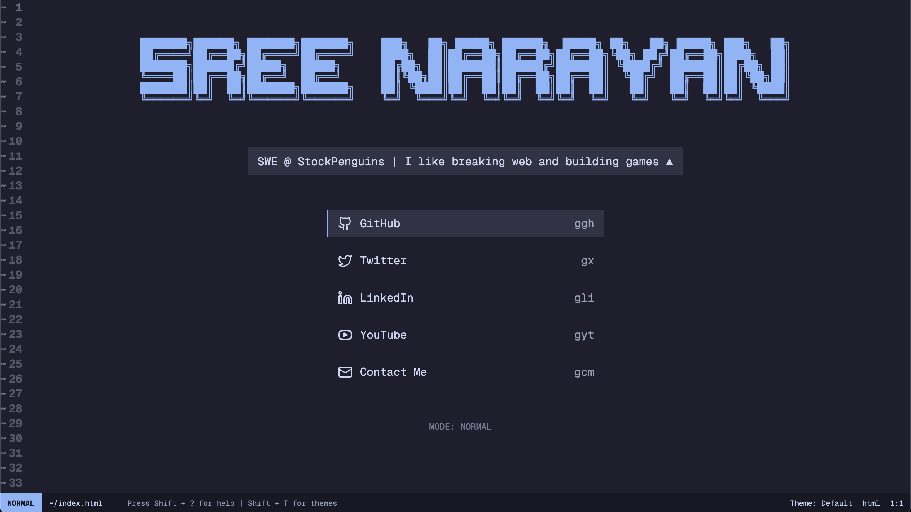

# Neovim-Style Portfolio

A sleek, Neovim-inspired personal portfolio website featuring vim-like keybindings, interactive UI, and smooth transitions. Built with SvelteKit and styled with Tailwind CSS.



## Demo : [https://www.eers.dev](www.eers.dev)

## Features

### Vim-Inspired Interface
- Vim-style navigation with `j/k` or Arrow keys
- Status line showing current mode and position
- Line numbers and empty line indicators (~)
- Smooth transitions between states

### Keyboard Navigation
- Navigate links using vim-style keybindings
- Quick access to social media profiles:
  - GitHub: `ggh`
  - Twitter: `gx`
  - LinkedIn: `gli`
  - YouTube: `gyt`
  - Contact: `gcm`

### Theme System
- Multiple built-in themes:
  - Default (Dark)
  - Catppuccin Mocha
  - Claude
  - Light
- Theme switching with `Shift + T`
- Smooth theme transitions


## Getting Started

1. Clone the repository:
```bash
git clone https://github.com/eersnington/neovim-style-portfolio.git
cd neovim-style-portfolio/myapp
```

2. Install dependencies:
```bash
pnpm install
```

3. Start the development server:
```bash
pnpm dev
```

4. Open [http://localhost:5173](http://localhost:5173) in your browser

## Building for Production

```bash
pnpm build
```

The static site will be generated in the `build/` directory.

## Keybindings

- `j/k` or Arrow keys: Navigate through links
- `Enter`: Open selected link
- `Shift + ?`: Show help modal
- `Shift + T`: Toggle theme switcher
- `Escape`: Close any open modal

### Quick Navigation
- `ggh`: Go to GitHub
- `gx`: Go to Twitter
- `gli`: Go to LinkedIn
- `gyt`: Go to YouTube
- `gcm`: Go to Contact

## Development

### Project Structure
```
myapp/
├── src/
│   ├── routes/
│   │   ├── +layout.svelte    # Root layout with fonts
│   │   ├── +page.svelte      # Main page component
│   │   └── layout.css        # Tailwind CSS import
│   ├── lib/
│   │   ├── components/       # Svelte components
│   │   │   ├── AsciiTitle.svelte
│   │   │   ├── KeybindHelp.svelte
│   │   │   ├── NavigationLinks.svelte
│   │   │   ├── StatusLine.svelte
│   │   │   ├── ThemeSwitcher.svelte
│   │   │   └── ...
│   │   ├── config.ts         # Site configuration
│   │   ├── themes.ts         # Theme definitions
│   │   ├── types.ts          # TypeScript types
│   │   ├── constants.ts      # App constants
│   │   └── utils/            # Utility functions
│   │       ├── index.ts
│   │       └── keyboard-utils.ts
│   └── app.html              # HTML template
├── static/                   # Static assets
├── svelte.config.js          # SvelteKit config
├── vite.config.ts            # Vite config
└── package.json
```

### Customization

1. Update site configuration in `src/lib/config.ts`:
```typescript
const config = {
  pageTitle: "Your Name | @handle",
  title: "Your Name",
  subtitle: "Your Title",
  links: [
    // Your social links
  ]
}
```

2. Add/modify themes in `src/lib/themes.ts`
3. Customize ASCII art in `src/lib/components/AsciiTitle.svelte`

## License

MIT License - feel free to use this for your own portfolio!

## Acknowledgments

- Inspired by Neovim's interface
- ASCII art powered by Figlet
- Icons by Lucide Svelte

## Contributing

1. Fork the repository
2. Create your feature branch (`git checkout -b feature/amazing-feature`)
3. Commit your changes (`git commit -m 'Add amazing feature'`)
4. Push to the branch (`git push origin feature/amazing-feature`)
5. Open a Pull Request

## Author

Created by [Sree N](https://github.com/eersnington) ([@eersnington](https://twitter.com/eersnington))

<a href="https://github.com/eersnington" target="_blank">

</a>&nbsp;&nbsp;
<a href="https://twitter.com/eersnington" target="_blank">

</a>
