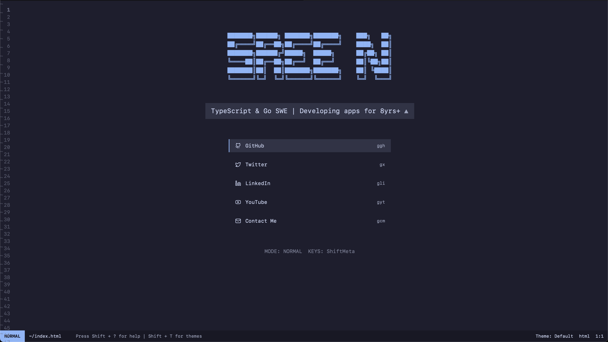

# Neovim-Style Portfolio

A sleek, Neovim-inspired personal portfolio website featuring vim-like keybindings, interactive UI, and smooth transitions. Built with Next.js 15 and styled with Tailwind CSS.



## Features

### 🎨 Vim-Inspired Interface
- Vim-style navigation with `j/k` or Arrow keys
- Status line showing current mode and position
- Line numbers and empty line indicators (~)
- Smooth transitions between states

### ⌨️ Keyboard Navigation
- Navigate links using vim-style keybindings
- Quick access to social media profiles:
  - GitHub: `ggh`
  - Twitter: `gx`
  - LinkedIn: `gli`
  - YouTube: `gyt`
  - Contact: `gcm`

### 🎭 Theme System
- Multiple built-in themes:
  - Default (Dark)
  - Catppuccin Mocha
  - Claude
  - Light
- Theme switching with `Shift + T`
- Smooth theme transitions

### 📱 Responsive Design
- Mobile-first approach
- Adaptive ASCII art for different screen sizes
- Smooth animations and transitions
- Accessible on all devices

## Tech Stack

- **Framework:** Next.js 15
- **Styling:** Tailwind CSS
- **UI Components:** Custom components with Vim-like aesthetics
- **ASCII Art:** Figlet with ANSI Shadow font
- **Animations:** CSS transitions
- **Icons:** Lucide React

## Getting Started

1. Clone the repository:
```bash
git clone https://github.com/eersnington/neovim-style-portfolio.git
cd neovim-style-portfolio
```

2. Install dependencies:
```bash
pnpm install
```

3. Start the development server:
```bash
pnpm dev
```

4. Open [http://localhost:3000](http://localhost:3000) in your browser

## OpenGraph Image

The project includes a custom OpenGraph image (`app/opengraph-image.png`) that showcases the portfolio's Neovim-inspired interface. This image is used when sharing the site on social media platforms.

- **Format:** PNG
- **Location:** `app/opengraph-image.png`
- **Twitter Card:** Also available as `app/twitter-image.png`
- **Favicon:** Available as `app/icon.png`

The OpenGraph image features:
- Dark theme aesthetics
- Vim-style interface elements
- ASCII art title
- Clean, minimalist design

## Keybindings

- `j/k` or Arrow keys: Navigate through links
- `Enter`: Open selected link
- `Shift + ?`: Show help modal
- `Shift + T`: Toggle theme switcher
- `Escape`: Close any open modal

### Quick Navigation
- `ggh`: Go to GitHub
- `gx`: Go to Twitter
- `gli`: Go to LinkedIn
- `gyt`: Go to YouTube
- `gcm`: Go to Contact

## Development

### Project Structure
```
├── app/
│   ├── layout.tsx      # Root layout with theme provider
│   ├── page.tsx        # Main page component
│   └── globals.css     # Global styles
├── components/
│   ├── ascii-title.tsx # ASCII art title component
│   ├── keybind-help.tsx# Help modal component
│   └── status-line.tsx # Vim-style status line
└── lib/
    ├── config.ts       # Site configuration
    ├── themes.ts       # Theme definitions
    └── utils.ts        # Utility functions
```

### Customization

1. Update site configuration in `lib/config.ts`:
```typescript
const config = {
  title: "Your Name",
  subtitle: "Your Title",
  links: [
    // Your social links
  ]
}
```

2. Add/modify themes in `lib/themes.ts`
3. Customize ASCII art loading states in `components/ascii-title.tsx`

## License

MIT License - feel free to use this for your own portfolio!

## Acknowledgments

- Inspired by Neovim's interface
- ASCII art powered by Figlet
- Icons by Lucide React

## Contributing

1. Fork the repository
2. Create your feature branch (`git checkout -b feature/amazing-feature`)
3. Commit your changes (`git commit -m 'Add amazing feature'`)
4. Push to the branch (`git push origin feature/amazing-feature`)
5. Open a Pull Request

## Author

Created by [Sree N](https://github.com/eersnington) ([@eersnington](https://twitter.com/eersnington))

<a href="https://github.com/eersnington" target="_blank">

</a>&nbsp;&nbsp;
<a href="https://twitter.com/eersnington" target="_blank">

</a>